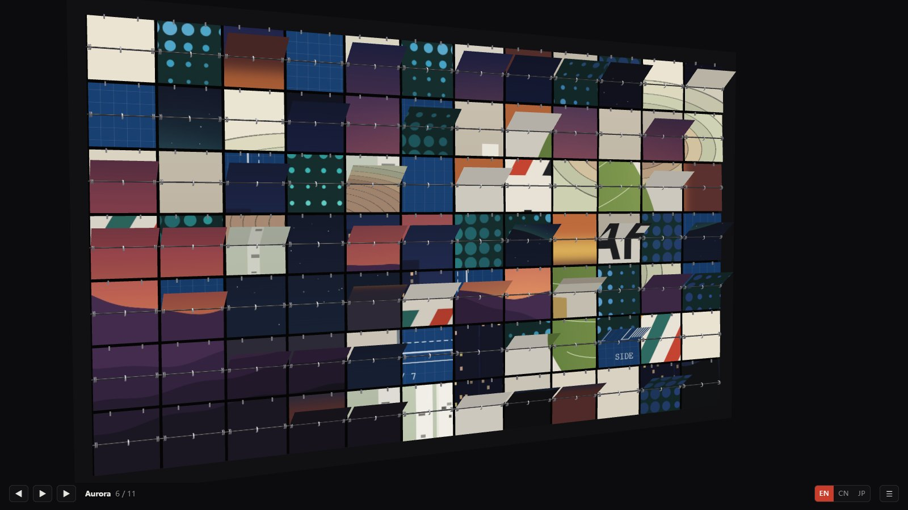
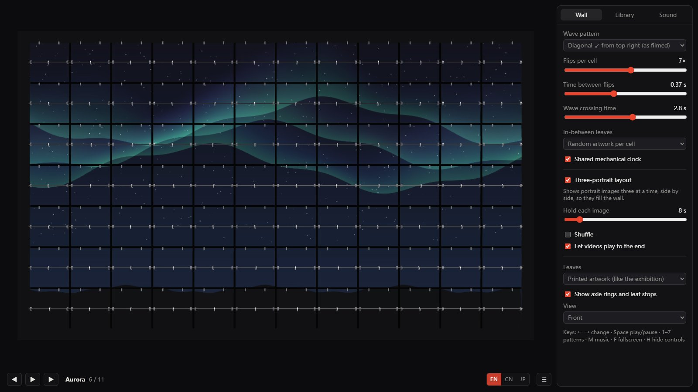

# Seventh Leaf

**A split-flap picture wall for your own photos, in the browser.**
Source-available and free for non-commercial use.

**▶ Try it now: <https://pipbaby.github.io/seventh-leaf/>**



Seventh Leaf is a wall of 84 split-flap cells (12 × 7). Each cell is split into an upper and a
lower half, like the letters on an old station departure board. When the picture changes, every
cell flips **seven times**. The in-between leaves show that cell's piece of *other* pictures, so
while the wave passes the wall is a patchwork of fragments. The new picture arrives on the seventh
leaf, and only when the last cell lands does one complete image settle.

Everything runs in your browser. Your photos, videos and music stay on your own computer.

## Run it on your own computer

The live demo above needs no installation. To run your own copy, you need the project files and
any simple local web server. There is no build step.

1. Download the project (**Code → Download ZIP** on GitHub) and unzip it.
2. Open a terminal in the unzipped folder and run **one** of these:

   ```bash
   python -m http.server 8000
   ```

   ```bash
   npx serve .
   ```

3. Open <http://localhost:8000> in your browser (or the address `npx serve` prints) and click
   **Start**. Sound can only begin after a click.

The wall opens with a set of demo pictures. Add your own in the **Library** tab.

## What you can do



- **Library.** Import photos and videos with the button, or drop them anywhere on the page.
  Reorder by dragging, delete with ×. For each picture, choose *Fill* (crop, with focus and zoom)
  or *Whole image* (with a blurred surround). Videos play live on the leaves.
- **Three-portrait layout.** Portrait photos are shown three at a time, side by side, so they fill
  the landscape wall. Each one gets exactly four of the twelve columns.
- **Wave patterns.** Diagonal from the top right (as filmed on the real wall), sweeps, top to
  bottom, a ripple from any point, random rain, or all at once.
- **3D view.** Drag to look at the wall from any angle and use the mouse wheel to zoom. The satin
  leaves catch the light as they move. Click a cell to flip just that one; Shift-click for a ripple.
- **Mechanism details.** Axle rings and the small stops along each upper edge can be shown or hidden.
- **Sound.** Separate volumes for flips, room echo, music and video sound. Add your own music. While
  a video has sound, the music can duck, keep playing, or pause. You can also replace the
  built-in flip sound with your own sample.
- **Languages.** English, 中文 and 日本語.
- **Keys.** ← → change picture · Space play/pause · 1–7 patterns · M music · F fullscreen ·
  H hide controls.

## Your own picture folder (optional)

Besides importing in the browser, you can point the wall at a folder of pictures. Create
`local/deck.json` next to `index.html`:

```json
{ "name": "My pictures", "items": [ { "file": "deck/one.jpg", "name": "One" } ] }
```

Items may also give `"w"` and `"h"` (pixel size) and `"thumb"` (a small preview), which makes the
library open instantly even with hundreds of pictures. When `local/deck.json` exists it replaces
the demo set. The `local/` folder is ignored by git, so pictures you may not redistribute (for
example photos of other people's artwork) never end up in the project by accident.

## How it was made

Seventh Leaf recreates a kinetic split-flap wall seen at an anniversary exhibition: a 12 × 7 wall
of physical cells with artwork printed on the leaves. It was filmed on a phone at 60 frames per
second, and the motion, timing and sound were measured from that recording frame by frame.

| | Measured | In Seventh Leaf |
|---|---|---|
| Clock | 0.185 s per tick, shared by the whole wall | Every leaf drops on a tick; each cell flips every second tick (0.37 s) |
| Wave | Diagonal, ≈0.16 s later per column to the left and per row down | Crosses the wall in about 2.8 s, a little unevenly |
| One change | ≈5.3 s, about 28 audible bursts | The same |
| A leaf's fall | ≈40 ms creep, a one-frame hesitation at the stops, then ≈0.21 s under gravity | Simulated as a 15 cm plate falling about its top edge; air drag is negligible |
| Settling | The landed leaf swings with a 0.63 s period (≈1.6 Hz) | A damped pendulum, different for each cell |
| Sound | A dry rustle, strongest at 1.3–2 kHz and 6–8 kHz, with broadband ticks | Synthesised in the browser (no recordings), with a short room echo |

### Code

No build tools and one dependency, three.js, which is included in `vendor/`.

| File | What it does |
|---|---|
| `src/wall.js` | The 3D wall. Each cell is two fixed halves and one falling leaf whose front and back carry different pictures. |
| `src/sequencer.js` | Timing: a queue of leaves for every cell, the wave patterns, the measured leaf motion and the settling swing. |
| `src/audio.js` | The flip-sound synthesis and the mixer (flips, room echo, music, video). |
| `src/library.js` | Pictures, videos and music stored in the browser (IndexedDB), the picture folder, and loading pictures only when they are needed. |
| `src/main.js` | Interface, slideshow and music player. |
| `src/i18n.js` | Interface text in English, Chinese and Japanese. |
| `tools/demo-pictures.html` | Draws the demo pictures. Open it in a browser to see them. |

## Browser support

Developed and tested in Chromium-based browsers (Chrome, Edge). Firefox and Safari are not yet
tested; reports are very welcome.

## Licence

Seventh Leaf is **source-available and free for non-commercial use**, under the
[PolyForm Noncommercial License 1.0.0](LICENSE). Copyright 2026 Pipbaby.

- **You may** use, copy, change and share it for any non-commercial purpose: personal use,
  hobby projects, study and research, and use by charities, schools and public institutions.
- **You may not** use it for commercial purposes, such as selling it, including it in a paid
  product or service, or using it to run a business. To ask about commercial use, contact Pipbaby
  through GitHub.
- When you share it, include the licence and its `Required Notice` line.

Because it restricts commercial use, Seventh Leaf is not "open source" in the sense of the
Open Source Definition. The demo pictures were generated for this project and are covered by the
same licence.

**Third-party code:** three.js is included in `vendor/three/` under its own MIT licence
(`vendor/three/LICENSE`), which still applies to it.

Built by Pipbaby with Claude.
